</p>

CyberChef is the self-purported 'Cyber Swiss-Army Knife' created by GCHQ. It's a fantastic tool for data transformation, extraction & manipulation in your web-browser.

Full credit to @GCHQ for producing the tool. See: https://gchq.github.io/CyberChef/

# General Tips

- Download CyberChef and run it entirely client-side. It doesn't need an internet connection except for certain operations. That way all your data is safe.
- Use Chrome. Although that might be painful for some. Chrome allows you to use postive lookbehinds which are [not supported](https://bugzilla.mozilla.org/show_bug.cgi?id=1225665) in Firefox
- Don't try and shoe-horn CyberChef into something that it can't do. It can do a lot but it's not a fully fledged programming language!

# Useful Regular Expressions

Mastering regular expressions are key to making the most of data manipulation in CyberChef (or any DFIR work). Below are some regexs that I keep coming back to.  

## Extracting Encoded Data

- Extract Base64: `[a-zA-Z0-9+/=]{30,}`  
    - Here '30' is an arbitrary number that can be adjusted according to the script.  
<p align="center">
  
</p>

- Extract Hexadecimal: `[a-fA-F0-9]{10,}`
    - This could also be adjusted to {32} (MD5), {40} (SHA1), {64}, SHA256 to extract various hashes
<p align="center">
  
</p>

- Extract Character Codes: `[\d]{2,3}(,|’)`
    - In this example it would extract character codes in the format ('30, 40, 50, 60')
<p align="center">
  
</p>

## Lookaheads & Lookbehinds

- Positive Lookbehind: `(?<=foo)(.*)`
    - Extract everything after 'foo' without including 'foo'
- Positive Lookahead: `^.*(?=bar)`
    - Extract everything before 'bar' without including 'bar'
- Lookahead/behind Combo: `(?<=')(.*?)(?=')`
    - Extract everything between ' and '
<p align="center">
  
</p>


## Working with APIs and CyberChef

CyberChef provides an operation HTTP Request (see Recipe 22) which allows HTTP requests to external resources. Due to Same Origin Policy (SOP) or lack of Cross-Origin Resource Sharing configuration many do not work. SOP is a security measure in modern browsers which prevents you from reading cross-site responses from servers which don't explicitly allow it via CORS. Check out [@GlassSec's talk on CyberChef](https://www.osdfcon.org/presentations/2019/Jonathan-Glass_Cybersecurity-Zero-to-Hero-With-CyberChef.pdf) which includes tips to boot Chrome without web-security to enable HTTP requests to otherwise restricted APIs (like Virus Total)

# CyberChef Recipes

Some example CyberChef recipes:  

[Recipe 1: Extract base64, raw inflate & beautify](#recipe-1---extract-base64-raw-inflate-and-code-beautify)

[Recipe 2: Invoke Obfuscation](#recipe-2---invoke-obfuscation)

[Recipe 3: From CharCode](#recipe-3---from-charcode)

[Recipe 4: Group Policy Preference Password Decryption](#recipe-4---group-policy-preference-passwords)

[Recipe 5: Using Loops and Labels](#recipe-5---using-loops--labels)

[Recipe 6: Google ei Timestamps](#recipe-6---google-ei-timestamp)

[Recipe 7: Multi-stage COM scriptlet to x86 assembly](#recipe-7---com-scriptlet-to-disassembled-x86-assembly)

[Recipe 8: Extract hexadecimal, convert to hexdump for embedded PE file](#recipe-8---extract-hexadecimal-convert-to-hexdump-for-embedded-pe-file)

[Recipe 9: Reverse strings, character substitution, from base64](#recipe-9---reverse-strings-character-substitution-from-base64)

[Recipe 10: Extract object from Squid proxy cache](#recipe-10---extract-object-from-squid-proxy-cache)

[Recipe 11: Extract GPS Coordinates to Google Maps URLs](#recipe-11---extract-gps-coordinates-to-google-maps-urls)

[Recipe 12: Big Number Processing](#recipe-12---big-number-processing)

[Recipe 13: Parsing DNS PTR records with Registers](#recipe-13---parsing-dns-ptr-records-with-registers)

[Recipe 14: Decoding POSHC2 executables](#recipe-14---decoding-poshc2-executables)

[Recipe 15: Parsing $MFT $SI Timestamps](#recipe-15---parsing-mft-si-timestamps)

[Recipe 16: Decoding PHP gzinflate and base64 webshells](#recipe-16---decoding-php-gzinflate-and-base64-webshells)

[Recipe 17: Extracting shellcode from a Powershell Meterpreter Reverse TCP Script](#recipe-17---extracting-shellcode-from-a-powershell-meterpreter-reverse-tcp-script)

[Recipe 18: Recycle Bin Parser with Subsections and Merges](#recipe-18---recycle-bin-parser-with-subsections-and-merges)

[Recipe 19: Identify Obfuscated Base64 with Regular Expression Highlighting](#recipe-19---identify-obfuscated-base64-with-regular-expression-highlighting)

[Recipe 20: Using Yara rules with deobfuscated malicious scripts](#recipe-20---using-yara-rules-with-deobfuscated-malicious-scripts)

[Recipe 21: Inline deobfuscation of hex encoded VBE script attached to a malicious LNK file](#recipe-21---inline-deobfuscation-of-hex-encoded-vbe-script-attached-to-a-malicious-lnk-file)

[Recipe 22: JA3 API search with HTTP Request and Registers](#recipe-22---ja3-api-search-with-http-request-and-registers)

[Recipe 23: Defeating DOSfuscation embedded in a malicious DOC file with Regular Expression capture groups](#recipe-23---defeating-dosfuscation-embedded-in-a-malicious-doc-file-with-regular-expression-capture-groups)

[Recipe 24: Picking a random letter from a six-byte string](#recipe-24---picking-a-random-letter-from-a-six-byte-string)

[Recipe 25: Creating a Wifi QR code](#recipe-25---creating-a-wifi-qr-code)

[Recipe 26: Extracting and Decoding a Multistage PHP Webshell](#recipe-26---extracting-and-decoding-a-multistage-php-webshell)

[Recipe 27: Decoding an Auto Visitor PHP script](#recipe-27---decoding-an-auto-visitor-php-script)

[Recipe 28: De-obfuscation of Cobalt Strike Beacon using Conditional Jumps to obtain shellcode](#recipe-28---de-obfuscation-of-cobalt-strike-beacon-using-conditional-jumps-to-obtain-shellcode)

[Recipe 29: Log File Timestamp Manipulation with Subsections and Registers](#recipe-29---log-file-timestamp-manipulation-with-subsections-and-registers)

[Recipe 30: CharCode obfuscated PowerShell Loader for a Cobalt Strike beacon](#recipe-30---charcode-obfuscated-powershell-loader-for-a-cobalt-strike-beacon)

[Recipe 31: Deobfuscate encoded strings in .NET binary](#recipe-31---deobfuscate-encoded-strings-in-.net-binary)  

[Recipe 32: Extract malicious Gootkit DLL from obfuscated registry data](#recipe-32---extract-malicious-gootkit-dll-from-obfuscated-registry-data)

[Recipe 33: Identify embedded URLs in Emotet PowerShell script](#recipe-33---identify-embedded-urls-in-emotet-powershell-script)

[Recipe 34: Analysing OOXML Files for URLs](#recipe-34---analysing-ooxml-files-for-urls)

[Recipe 35: Decrypting REvil PowerShell ransomware sample](#recipe-35---decrypting-revil-powershell-ransomware-sample)

[Recipe 36: Create a CyberChef Password Generator](#recipe-36---create-a-cyberchef-password-generator)

[Recipe 37: From Sandbox zipped email to malicious URL](#recipe-37---from-sandbox-zipped-email-to-malicious-url)

[Recipe 38: Planes, Skulls and Envelopes - Live and Let PowerShell](#recipe-38---planes-skulls-and-envelopes---live-and-let-powershell)

[Recipe 39: Decrypt GoldMax aka Sunshutte encrypted configuration files](#recipe-39---decrypt-goldmax-aka-sunshutte-encrypted-configuration-files)

[Recipe 40: Morse Code Madness](#recipe-40---morse-code-madness)

[Recipe 41: PHP mixed hexadecimal and octal encoding](#recipe-41---php-mixed-hexadecimal-and-octal-encoding)

## Recipe 1 - Extract base64, raw inflate and code beautify

A very common scenario: extract Base64, inflate, beautify the code. You may need to then do further processing or dynamic analysis depending on the next stage.

Filename: ahack.bat

Zipped File: cc9c6c38840af8573b8175f34e5c54078c1f3fb7c686a6dc49264a0812d56b54_183SnuOIVa.bin.gz

Sample: SHA256 cc9c6c38840af8573b8175f34e5c54078c1f3fb7c686a6dc49264a0812d56b54

https://www.hybrid-analysis.com/sample/cc9c6c38840af8573b8175f34e5c54078c1f3fb7c686a6dc49264a0812d56b54?environmentId=120

### Recipe Details

```[{"op":"Regular expression","args":["User defined","[a-zA-Z0-9+/=]{30,}",true,true,false,false,false,false,"List matches"]},{"op":"From Base64","args":["A-Za-z0-9+/=",true]},{"op":"Raw Inflate","args":[0,0,"Adaptive",false,false]},{"op":"Generic Code Beautify","args":[]}]```


## Recipe 2 - Invoke-Obfuscation

CyberChef won't be able to handle all types of Invoke-Obfuscation, but here is one that can be decoded.

Filename: Acknowledgement NUT-95-52619.eml

Zipped File: 1240695523bbfe3ed450b64b80ed018bd890bfa81259118ca2ac534c2895c835.bin.gz

Sample: SHA256 1240695523bbfe3ed450b64b80ed018bd890bfa81259118ca2ac534c2895c835

https://www.hybrid-analysis.com/sample/1240695523bbfe3ed450b64b80ed018bd890bfa81259118ca2ac534c2895c835?environmentId=120


### Recipe Details

```[{"op":"Find / Replace","args":[{"option":"Regex","string":"\\^|\\\\|-|_|\\/|\\s"},"",true,false,true,false]},{"op":"Reverse","args":["Character"]},{"op":"Generic Code Beautify","args":[]},{"op":"Find / Replace","args":[{"option":"Simple string","string":"http:"},"http://",true,false,true,false]},{"op":"Extract URLs","args":[false]},{"op":"Defang URL","args":[true,true,true,"Valid domains and full URLs"]}]```


##  Recipe 3 - From CharCode

Malware and scripts often use Charcode to represent characters in order to evade from AV and EDR solutions. CyberChef eats this up.

Filename: 3431818-f71f60d10b1cbe034dc1be242c6efa5b9812f3c6.zip

Source: https://gist.github.com/jonmarkgo/3431818

### Recipe Details

```[{"op":"Regular expression","args":["User defined","([0-9]{2,3}(,\\s|))+",true,true,false,false,false,false,"List matches"]},{"op":"From Charcode","args":["Comma",10]},{"op":"Regular expression","args":["User defined","([0-9]{2,3}(,\\s|))+",true,true,false,false,false,false,"List matches"]},{"op":"From Charcode","args":["Space",10]}]```


## Recipe 4 - Group Policy Preference passwords

When a new GPP is created, there’s an associated XML file created in SYSVOL with the relevant configuration data and if there is a password provided, it is AES-256 bit encrypted. Microsoft published the AES Key, which can be used to decrypt passwords store in:  \\<DOMAIN>\SYSVOL\<DOMAIN>\Policies\

Credit: @cyb3rops

Source 1: https://twitter.com/cyb3rops/status/1036642978167758848

Source 2: https://adsecurity.org/?p=2288

### Recipe Details

```[{"op":"From Base64","args":["A-Za-z0-9+/=",true]},{"op":"To Hex","args":["None"]},{"op":"AES Decrypt","args":[{"option":"Hex","string":"4e9906e8fcb66cc9faf49310620ffee8f496e806cc057990209b09a433b66c1b"},{"option":"Hex","string":""},"CBC","Hex","Raw",{"option":"Hex","string":""}]},{"op":"Decode text","args":["UTF16LE (1200)"]}]```


## Recipe 5 - Using loops & labels

CyberChef can use labels to identify parts of the recipe and then loop back to perform operations multiple times. In this example, there are 29 rounds of Base64 encoding which are extracted and decoded.

Credit: @pmelson

Source File: hmCPDnHs.txt

Source 1: https://pastebin.com/hmCPDnHs

Source 2: https://twitter.com/pmelson/status/1078776229996752896

Also see more example of loops over Base64: https://twitter.com/QW5kcmV3/status/1079095274776289280 (Credit: @QW5kcmV3)

### Recipe Details

```[{"op":"Label","args":["top"]},{"op":"Regular expression","args":["User defined","[a-zA-Z0-9+/=]{30,}",true,true,false,false,false,false,"List matches"]},{"op":"From Base64","args":["A-Za-z0-9+/=",true]},{"op":"Raw Inflate","args":[0,0,"Adaptive",false,false]},{"op":"Jump","args":["top",28]},{"op":"Generic Code Beautify","args":[]}]```


## Recipe 6 - Google ei timestamp

Google uses its own timestamp, I call ei time, which it embeds in the URL.

Source: https://bitofhex.com/2018/05/29/cyberchef/

### Recipe Details

```[{"op":"From Base64","args":["A-Za-z0-9-_=",true]},{"op":"To Hex","args":["None"]},{"op":"Take bytes","args":[0,8,false]},{"op":"Swap endianness","args":["Hex",4,true]},{"op":"From Base","args":[16]},{"op":"From UNIX Timestamp","args":["Seconds (s)"]}]```


## Recipe 7 - COM scriptlet to disassembled x86 assembly

This is an eleven-stage decoded COM scriptlet that uses Base64, Gunzip, RegEx, and Disassemble x86 instructions.

Credit: @JohnLaTwC

Filename: 41a6e22ec6e60af43269f4eb1eb758c91cf746e0772cecd4a69bb5f6faac3578.txt

Source 1: https://gist.githubusercontent.com/JohnLaTwC/aae3b64006956e8cb7e0127452b5778f/raw/f1b23c84c654b1ea60f0e57a860c74385915c9e2/43cbbbf93121f3644ba26a273ebdb54d8827b25eb9c754d3631be395f06d8cff

Source 2: https://twitter.com/JohnLaTwC/status/1062419803304976385

### Recipe Details

```[{"op":"Regular expression","args":["","[A-Za-z0-9=/]{40,}",true,true,false,false,false,false,"List matches"]},{"op":"From Base64","args":["A-Za-z0-9+/=",true]},{"op":"Remove null bytes","args":[]},{"op":"Regular expression","args":["User defined","[A-Za-z0-9+/=]{40,}",true,true,false,false,false,false,"List matches"]},{"op":"From Base64","args":["A-Za-z0-9+/=",true]},{"op":"Gunzip","args":[]},{"op":"Regular expression","args":["User defined","[A-Za-z0-9+/=]{40,}",true,true,false,false,false,false,"List matches"]},{"op":"From Base64","args":["A-Za-z0-9+/=",true]},{"op":"To Hex","args":["Space"]},{"op":"Remove whitespace","args":[true,true,true,true,true,false]},{"op":"Disassemble x86","args":["32","Full x86 architecture",16,0,true,true]}]```


## Recipe 8 - Extract hexadecimal, convert to hexdump for embedded PE file

This file has an embedded PE file (SHA 256: 26fac1d4ea12cdceac0d64ab9694d0582104b3c84d7940a4796c1df797d0fdc2, R5Sez8PH.exe, VT: 54/70). Using CyberChef, we can regex hexadecimal and the convert to a more easily viewable hexdump.

Source 1: https://pastebin.com/R5Sez8PH (sorry: no longer available!)

Source 2: https://twitter.com/ScumBots/status/1081949877272276992

### Recipe Details

```[{"op":"Regular expression","args":["User defined","[a-fA-F0-9]{200,}",true,true,false,false,false,false,"List matches"]},{"op":"From Hex","args":["Auto"]},{"op":"To Hexdump","args":[16,false,false]}]```


## Recipe 9 - Reverse strings, character substitution, from base64

A blob of base64 with some minor bytes to be substituted. Original decoding done by @pmelson in Python and converted to CyberChef.

Credit: @pmelson

Source 1: https://pastebin.com/RtjrweYF / RtjrweYF.txt

Source 2: https://twitter.com/pmelson/status/1076893022758100998

### Recipe Details

```[{"op":"Reverse","args":["Character"]},{"op":"Find / Replace","args":[{"option":"Regex","string":"%"},"A",true,false,true,false]},{"op":"Find / Replace","args":[{"option":"Regex","string":"×"},"T",true,false,false,false]},{"op":"Find / Replace","args":[{"option":"Simple string","string":"÷"},"V",true,false,false,false]},{"op":"From Base64","args":["A-Za-z0-9+/=",true]},{"op":"To Hexdump","args":[16,false,false]}]```


## Recipe 10 - Extract object from Squid proxy cache

Don't manually carve out your Squid cache objects. Simply upload the file to CyberChef. This recipe will search for the magic bytes 0x0D0A0D0A, extract everything after. It then gzip decompresses the object for download.

Source: 00000915 (output should be TrueCrypt_Setup_7.1a.exe with SHA256 e95eca399dfe95500c4de569efc4cc77b75e2b66a864d467df37733ec06a0ff2)

### Recipe Details

```[{"op":"To Hex","args":["None"]},{"op":"Regular expression","args":["User defined","(?<=0D0A0D0A).*$",true,false,false,false,false,false,"List matches"]},{"op":"From Hex","args":["Auto"]},{"op":"Gunzip","args":[]}]```


## Recipe 11 - Extract GPS Coordinates to Google Maps URLs

If you need to quickly triage where a photo was taken and you're lucky enought to have embedded GPS latitude and longitudes then use this recipe to quickly make a usable Google Maps URL to identify the location.

### Recipe Details

```[{"op":"Extract EXIF","args":[]},{"op":"Regular expression","args":["User defined","((?<=GPSLatitude:).*$)|((?<=GPSLongitude: ).*$)",true,true,false,false,false,false,"List matches"]},{"op":"Find / Replace","args":[{"option":"Extended (\\n, \\t, \\x...)","string":"\\n"},",",true,false,true,false]},{"op":"Find / Replace","args":[{"option":"Simple string","string":" "},"https://maps.google.com/?q=",true,false,true,false]}]```


## Recipe 12 - Big Number Processing

CyberChef can handle massive numbers. Here we can use a simple recipe to change a 38-digit X509SerialNumber to its hexadecimal equivalent X.509 certificate serial number. Then we can regex the hexadecimal and insert a colon to transform it to the correct format.

Credit: @QW5kcmV3

Source: https://twitter.com/QW5kcmV3/status/949437437473968128

### Recipe Details

```[{"op":"To Base","args":[16]},{"op":"Regular expression","args":["User defined","[a-f0-9]{2,2}",true,true,false,false,false,false,"List matches"]},{"op":"Find / Replace","args":[{"option":"Extended (\\n, \\t, \\x...)","string":"\\n"},":",true,false,true,false]}]```


## Recipe 13 - Parsing DNS PTR records with Registers

IP addresses in DNS PTR records are stored as least significant octet first. For example: 167.139.44.10.in-addr.arpa would relate to IP address of 10.44.139.167. Using CyberChef's registers we can allocate each octet to a memory register (or variable if it's easier to think of it that way). These can then be reversed to re-order the IP address. A find/replace tidies up the rest of the record. This could be reversed it you wanted to translate 'regular' IP addresses to search in DNS PTR records. 


### Recipe Details

```[{"op":"Fork","args":["\\n","\\n",false]},{"op":"Register","args":["(\\d{1,3}).(\\d{1,3}).(\\d{1,3}).(\\d{1,3})",true,false,false]},{"op":"Find / Replace","args":[{"option":"Regex","string":"$R0.$R1.$R2.$R3"},"$R3.$R2.$R1.$R0",true,false,true,false]},{"op":"Find / Replace","args":[{"option":"Regex","string":".in-addr.arpa"},"",true,false,true,false]}]```

## Recipe 14 - Decoding POSHC2 executables

PoshC2 is a proxy aware C2 framework that utilises Powershell to aid penetration testers with red teaming, post-exploitation and lateral movement. The dropper is based on PowerShell and consists of a PowerShell script which is double Base64 encoded and compressed. Extracting the strings can be done with CyberChef as detailed below. Depending on the settings and customisation of the executable you may need to adjust your recipe. 

Credit: @a_tweeter_user

Source: https://twitter.com/a_tweeter_user/status/1100751236687642624

Source: posh.zip


### Recipe Details

```[{"op":"Strings","args":["All",4,"Alphanumeric + punctuation (A)",false]},{"op":"Remove null bytes","args":[]},{"op":"Regular expression","args":["User defined","[a-zA-Z0-9+=]{200,}",true,true,false,false,false,false,"List matches"]},{"op":"From Base64","args":["A-Za-z0-9+/=",true]},{"op":"Remove null bytes","args":[]},{"op":"Regular expression","args":["User defined","[a-z0-9/\\\\+=]{100,}",true,true,false,false,false,false,"List matches"]},{"op":"From Base64","args":["A-Za-z0-9+/=",true]},{"op":"Raw Inflate","args":[0,0,"Adaptive",false,false]}]```

##  Recipe 15 - Parsing $MFT $SI Timestamps

CyberChef can do just about anything with data. Here are raw hex bytes from a $MFT entry. By selecting certain bytes, and using various functions of CyberChef I can parse any part of the data as needed. This recipe will extract and parse the $SI timestamps. Encase no more!


### Recipe Details

```[{"op":"Take bytes","args":[160,64,false]},{"op":"Regular expression","args":["User defined",".{16}",true,true,true,false,false,false,"List matches with capture groups"]},{"op":"Fork","args":["\\n","\\n",false]},{"op":"Swap endianness","args":["Hex",10,true]},{"op":"Remove whitespace","args":[true,true,true,true,true,false]},{"op":"Windows Filetime to UNIX Timestamp","args":["Nanoseconds (ns)","Hex"]},{"op":"From UNIX Timestamp","args":["Nanoseconds (ns)"]},{"op":"Merge","args":[]},{"op":"Register","args":["(.*)\\n(.*)\\n(.*)\\n(.*)",true,false,false]},{"op":"Find / Replace","args":[{"option":"Regex","string":"$R0"},"$SI Creation Time: $R0",true,false,true,false]},{"op":"Find / Replace","args":[{"option":"Regex","string":"$R1"},"$SI Modified Time: $R1",true,false,true,false]},{"op":"Find / Replace","args":[{"option":"Regex","string":"$R2"},"$SI MFT Change Time: $R2",true,false,true,false]},{"op":"Find / Replace","args":[{"option":"Regex","string":"$R3"},"$SI Access Time: $R3",false,false,true,false]}]```

## Recipe 16 - Decoding PHP gzinflate and base64 webshells

Webshells come in all shapes and sizes. For PHP webshells the combination of gzinflate and base64 can be used to obfuscate the eval data. In this example, there are 21 rounds of compression and base64 that we can quickly parse out using labels and loops.

Source: https://github.com/LordWolfer/webshells/blob/b7eefaff64049e3ff61e90c850686135c0ba74c4/from_the_wild1.php


### Recipe Details

```[{"op":"Label","args":["start"]},{"op":"Regular expression","args":["User defined","[a-zA-Z0-9=/+]{10,}",true,true,false,false,false,false,"List matches"]},{"op":"From Base64","args":["A-Za-z0-9+/=",true]},{"op":"Raw Inflate","args":[0,0,"Block",false,false]},{"op":"Jump","args":["start",21]}]```

## Recipe 17 - Extracting shellcode from a Powershell Meterpreter Reverse TCP script

Often seen in @pmelson's Pastbin bot @scumbots, this peels away multiple layers of an encoded Powershell script to display the shellcode. From here you *could* extract PUSH statements to try and identify the IP address & port, but you'll get too many false positives. So you're better off using a tool like scdbg (see: http://sandsprite.com/blogs/index.php?uid=7&pid=152)

Source: https://twitter.com/ScumBots/status/1121854255898472453

Source: https://pastebin.com/9DnD6t6W / 9DnD6t6W.txt


### Recipe Details

```[{"op":"Regular expression","args":["User defined","[a-zA-Z0-9=/+]{30,}",true,true,false,false,false,false,"List matches"]},{"op":"From Base64","args":["A-Za-z0-9+/=",true]},{"op":"Remove null bytes","args":[]},{"op":"Regular expression","args":["User defined","[a-zA-Z0-9=/+]{30,}",true,true,false,false,false,false,"List matches"]},{"op":"From Base64","args":["A-Za-z0-9+/=",true]},{"op":"Gunzip","args":[]},{"op":"Regular expression","args":["User defined","[a-zA-Z0-9=/+]{30,}",true,true,false,false,false,false,"List matches"]},{"op":"From Base64","args":["A-Za-z0-9+/=",true]},{"op":"To Hex","args":["None"]},{"op":"Disassemble x86","args":["32","Full x86 architecture",16,0,true,true]}]```


## Recipe 18 - Recycle Bin Parser with Subsections and Merges

Subsections and Merges are powerful tools in CyberChef that allow the application of ingredients to a selection of data rather than the whole input file. This section can then be merged together to continue on the whole input. In an awesome piece of work @GlassSec has created a Windows Recycle Bin parser using CyberChef indicating the possibilities of these functions is endless.

Source: https://gist.github.com/glassdfir/f30957b314ec39a8aa319420a29ffc76

Credit: https://twitter.com/GlassSec


### Recipe Details

```[{"op":"Conditional Jump","args":["^(\\x01|\\x02)",true,"Error",10]},{"op":"Find / Replace","args":[{"option":"Regex","string":"^(\\x02.{23})(....)"},"$1",false,false,false,false]},{"op":"Subsection","args":["^.{24}(.*)",true,true,false]},{"op":"Decode text","args":["UTF16LE (1200)"]},{"op":"Find / Replace","args":[{"option":"Regex","string":"^(.*)."},"\\nDeleted File Path: $1",false,false,false,false]},{"op":"Merge","args":[]},{"op":"Subsection","args":["^.{16}(.{8})",false,true,false]},{"op":"Swap endianness","args":["Raw",8,true]},{"op":"To Hex","args":["None"]},{"op":"Windows Filetime to UNIX Timestamp","args":["Seconds (s)","Hex"]},{"op":"From UNIX Timestamp","args":["Seconds (s)"]},{"op":"Find / Replace","args":[{"option":"Regex","string":"^(.* UTC)"},"\\nFile Deletion Time: $1",true,false,true,false]},{"op":"Merge","args":[]},{"op":"Subsection","args":["^.{8}(.{8})",true,true,false]},{"op":"To Hex","args":["None"]},{"op":"Swap endianness","args":["Hex",8,true]},{"op":"From Base","args":[16]},{"op":"Find / Replace","args":[{"option":"Regex","string":"^(.*)"},"\\nDeleted File Size: $1 bytes",true,false,true,true]},{"op":"Merge","args":[]},{"op":"Find / Replace","args":[{"option":"Regex","string":"^.{8}"},"******** WINDOWS RECYCLE BIN METADATA ********",true,false,false,false]},{"op":"Jump","args":["Do Nothing",10]},{"op":"Label","args":["Error"]},{"op":"Find / Replace","args":[{"option":"Regex","string":"^.*$"},"This doesn't look like a Recycle Bin file to me ",true,false,true,false]},{"op":"Label","args":["Do Nothing"]}]```

##  Recipe 19 - Identify Obfuscated Base64 with Regular Expression Highlighting

Less of a recipe and more of a technique. Using the 'highlight' function of the regular expression ingredient can clearly bring out where base64 data has been broken up with non-traditional base64 character set. Here the sequence '@<!' is used to obfuscate and disrupt automated encoding conversion. Looking further down the script, the sequence is substituted with 'A', which can then be inserted with a Find/Replace prior to the extraction. This continues for multiple rounds until a domain of interest is revealed (along with an executable prior).

Source: https://pastebin.com/TmJsB0Nv & https://twitter.com/pmelson/status/1167065236907659264


### Recipe Details

```[{"op":"Find / Replace","args":[{"option":"Simple string","string":"@<!"},"A",true,false,true,false]},{"op":"Regular expression","args":["User defined","[a-zA-Z0-9+/=]{20,}",true,true,false,false,false,false,"List matches"]},{"op":"From Base64","args":["A-Za-z0-9+/=",true]},{"op":"Regular expression","args":["User defined","[a-zA-Z0-9+/=]{50,}",true,true,false,false,false,false,"List matches"]},{"op":"From Base64","args":["A-Za-z0-9+/=",true]},{"op":"Find / Replace","args":[{"option":"Simple string","string":"@<!"},"A",true,false,true,false]},{"op":"Regular expression","args":["User defined","[a-zA-Z0-9+/=]{50,}",true,true,false,false,false,false,"List matches"]},{"op":"From Base64","args":["A-Za-z0-9+/=",true]}]```

## Recipe 20 - Using Yara rules with deobfuscated malicious scripts

Although not the most convenient way, CyberChef does provide the ability to run a yara rule over the output of a recipe. You could combine this by using the [multiple inputs](https://github.com/gchq/CyberChef/wiki/Multiple-Inputs) function to scan a larger number of files.

Source: https://twitter.com/ScumBots/status/1168528510681538560 & https://pastebin.com/r40SXe7V


### Recipe Details

```[{"op":"Regular expression","args":["User defined","\\(.*\\);",true,false,false,false,false,false,"List matches"]},{"op":"Find / Replace","args":[{"option":"Regex","string":",|\\(|\\);"}," ",true,false,true,false]},{"op":"From Charcode","args":["Space",10]},{"op":"YARA Rules","args":["rule SuspiciousPowerShell {\n   meta:\n      description = \"Testing Yara on Cyberchef for Powershell\"\n   strings:\n      $a1 = \"[System.Reflection.Assembly]\" ascii\n      $a2 = \"IEX\" ascii nocase\n      $a3 = \"powershell.exe -w hidden -ep bypass -enc\" ascii\n   condition:\n      2 of them\n}",true,true,true,true]}]```

## Recipe 21 - Inline deobfuscation of hex encoded VBE script attached to a malicious LNK file

This recipe extracts a VBE payload from a Microsoft Shortcut File (LNK) and then decodes the hex strings in-line using subsections.

Source: malicious.lnk.bin


### Recipe Details

```[{"op":"Microsoft Script Decoder","args":[]},{"op":"Subsection","args":["(?<=\\(\\\")(.*?)(?=\\\"\\))",true,true,false]},{"op":"Fork","args":["\\n","\\n",false]},{"op":"From Hex","args":["Auto"]}]```

## Recipe 22 - JA3 API search with HTTP Request and Registers

Using the HTTP Request function and Registers we can enrich out data with that from an API or external resource. Here we are searching against three [JA3 hashes](https://engineering.salesforce.com/tls-fingerprinting-with-ja3-and-ja3s-247362855967) for any known bad.  

Source: Input hashes: 1aa7bf8b97e540ca5edd75f7b8384bfa, 1be3ecebe5aa9d3654e6e703d81f6928, and b386946a5a44d1ddcc843bc75336dfce  


### Recipe Details

```[{"op":"Comment","args":["https://ja3er.com/search/hash"]},{"op":"Fork","args":["\\n","\\n",false]},{"op":"Register","args":["(.*)",true,false,false]},{"op":"HTTP request","args":["GET","https://ja3er.com/search/$R0","","Cross-Origin Resource Sharing",false]},{"op":"JSON Beautify","args":["    ",false]}]```

## Recipe 23 - Defeating DOSfuscation embedded in a malicious DOC file with Regular Expression capture groups

This malicious DOC file is downloaded straight from Hybrid-Analysis. We gunzip it out, select the dosfuscation with a regular expression, then select the critical section that is being used with the 'set' function. This section is deobfuscated with a reverse for loop with a step of three. So once selected we reverse the string and use regular expression capture groups to select every third character. This is great work from Hack eXPlorer on YouTube. Go there and watch!

Source: Untitled-11232018-659370.doc.bin.gz

Credit: Adapted from Hack eXPlorer's video [Hiding Malicious code using windows CMD - Dosfuscation](https://www.youtube.com/watch?v=ptsF2PvD4vY)  


### Recipe Details

```[{"op":"Gunzip","args":[]},{"op":"Regular expression","args":["User defined","c:\\\\.*\"",true,true,false,false,false,false,"List matches"]},{"op":"Find / Replace","args":[{"option":"Simple string","string":"^"},"",true,false,true,false]},{"op":"Regular expression","args":["User defined","(?<=9ojB\\=)(.*?)(?=\\)  )",true,true,false,false,false,false,"List matches"]},{"op":"Reverse","args":["Character"]},{"op":"Regular expression","args":["User defined","(.)..",true,true,false,false,false,false,"List capture groups"]},{"op":"Find / Replace","args":[{"option":"Regex","string":"\\n"},"",true,false,true,false]},{"op":"Extract URLs","args":[false]},{"op":"Extract domains","args":[true]}]```  

## Recipe 24 - Picking a random letter from a six-byte string

A [request](https://twitter.com/mattnotmax/status/1244586103006347268) for assistance led to this recipe which uses Registers, HTTP request and some Regex to select a random character from a six-byte string. 

Credit: Adapted from [Steve Thompson](https://twitter.com/poohstix16/status/1244505538307776513)


### Recipe Details

`[{"op":"Register","args":["(.*)",true,false,false]},{"op":"HTTP request","args":["GET","https://www.random.org/integers/?num=1&min=1&max=6&col=1&base=10&format=plain&rnd=new","","Cross-Origin Resource Sharing",false]},{"op":"Register","args":["(.)",true,false,false]},{"op":"Find / Replace","args":[{"option":"Regex","string":"(.)"},"$R0",true,false,true,false]},{"op":"Regular expression","args":["User defined","(.){$R1}",true,true,false,false,false,false,"List capture groups"]},{"op":"Head","args":["Line feed",1]}]`

## Recipe 25 - Creating a WiFi QR code

Either for ease of letting your mates access your guest wifi, or for any Red Team that needs to add tempting convenience to a rogue access point! Using the create QR Code function to allow Android or iOS devices to logon to your Wifi.

Credit: https://twitter.com/mattnotmax/status/1242031548884369408  
Background: https://github.com/zxing/zxing/wiki/Barcode-Contents#wi-fi-network-config-android-ios-11

### Recipe Details

`Generate_QR_Code('PNG',5,2,'Medium')`


## Recipe 26 - Extracting and Decoding a Multistage PHP Webshell

Decoding a Webshell documented by [SANS](https://isc.sans.edu/forums/diary/Another+webshell+another+backdoor/22826/) entirely within Cyberchef using regex, ROT13, HTTP Request, Registers and more!  

Credit: https://twitter.com/thebluetoob  

### Recipe Details

`[{"op":"Regular expression","args":["User defined","(?<=')(.*?)(?=')",true,true,false,false,false,false,"List matches"]},{"op":"From Base64","args":["A-Za-z0-9+/=",true]},{"op":"ROT13","args":[true,true,13]},{"op":"Raw Inflate","args":[0,0,"Adaptive",false,false]},{"op":"ROT13","args":[true,true,13]},{"op":"Extract URLs","args":[false]},{"op":"Register","args":["(.*)",true,false,false]},{"op":"HTTP request","args":["GET","$R0","","Cross-Origin Resource Sharing",false]},{"op":"Strings","args":["Single byte",4,"Alphanumeric + punctuation (A)",false]},{"op":"Regular expression","args":["User defined","[a-zA-Z0-9+=/]{30,}",true,true,false,false,false,false,"List matches"]},{"op":"From Base64","args":["A-Za-z0-9+/=",true]},{"op":"Regular expression","args":["User defined","(?<=')(.*?)(?=')",true,true,false,false,false,false,"List matches"]},{"op":"From Base64","args":["A-Za-z0-9+/=",true]},{"op":"Raw Inflate","args":[0,0,"Adaptive",false,false]},{"op":"ROT13","args":[true,true,13]},{"op":"Regular expression","args":["User defined","[a-zA-Z0-9+=/]{30,}",true,true,false,false,false,false,"List matches"]},{"op":"From Base64","args":["A-Za-z0-9+/=",true]}]`

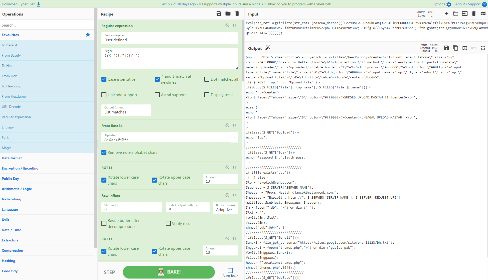

## Recipe 27 - Decoding an Auto Visitor PHP script

Decoding an auto visitor script written in PHP within Cyberchef using regex, ROT13, multiple decompression algorithms, and *subsections*! The key point to consider is there are two variables using different rounds of obfuscation. You have a couple of options: work in multiple CyberChef windows to get the end result, or, as below, use subsections and greg for each variable to manipulate each independently and get both deobfuscated outputs in the one script. You can shorten the recipe further by using loops to jump the multiple rounds of Raw Inflate.

Credit: Original script provided by [@NtSetDefault](https://twitter.com/NtSetDefault), original Cyberchef recipe(s) created by [@thebluetoob](https://twitter.com/thebluetoob), and refined by [@mattnotmax](https://twitter.com/mattnotmax) in to one recipe.

### Recipe Details

`[{"op":"Regular expression","args":["User defined","(?<=')(.*?)(?=')",true,true,false,false,false,false,"List matches"]},{"op":"From Base64","args":["A-Za-z0-9+/=",true]},{"op":"ROT13","args":[true,true,13]},{"op":"Raw Inflate","args":[0,0,"Adaptive",false,false]},{"op":"ROT13","args":[true,true,13]},{"op":"Subsection","args":["(?<=\\$Fadly.*?\")(.*?)(?=\\\")",true,true,false]},{"op":"From Base64","args":["A-Za-z0-9+/=",true]},{"op":"URL Decode","args":[]},{"op":"From HTML Entity","args":[]},{"op":"Merge","args":[]},{"op":"Subsection","args":["(?<=\\$Gans.*?\")(.*?)(?=\\\")",true,true,false]},{"op":"Reverse","args":["Character"]},{"op":"From Base64","args":["A-Za-z0-9+/=",true]},{"op":"Label","args":["jump"]},{"op":"Raw Inflate","args":[0,0,"Adaptive",false,false]},{"op":"Jump","args":["jump",2]},{"op":"Zlib Inflate","args":[0,0,"Adaptive",false,false]},{"op":"Zlib Inflate","args":[0,0,"Adaptive",false,false]}]`

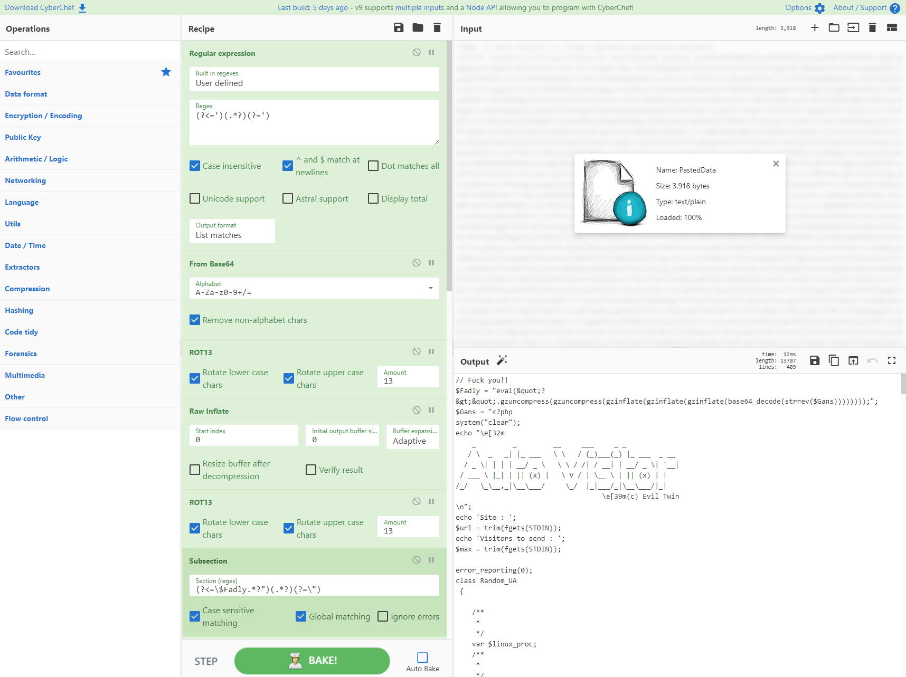

## Recipe 28 - De-obfuscation of Cobalt Strike Beacon using Conditional Jumps to obtain shellcode  

Choose your poison with this ingenious script from [@0xtornado](https://twitter.com/0xtornado) which determines which type of obfuscation your beacon script has via CyberChef conditional jumps to parse out the shellcode. First the code looks for a simple regex 'bxor' to then jump to the appropriate section of the recipe. Else it parses out the second type. Using CyberChef 'tabs' you can load up two different scripts and get out your data. Impress your colleagues and friendly red team or local APT crew!  

Credit: https://twitter.com/0xtornado/status/1255866333545316352  

### Recipe Details

`[{"op":"Conditional Jump","args":["bxor",false,"Decode_Shellcode",10]},{"op":"Label","args":["Decode_beacon"]},{"op":"From Base64","args":["A-Za-z0-9+/=",true]},{"op":"Decode text","args":["UTF-16LE (1200)"]},{"op":"Regular expression","args":["User defined","[a-zA-Z0-9+/=]{30,}",true,true,false,false,false,false,"List matches"]},{"op":"From Base64","args":["A-Za-z0-9+/=",true]},{"op":"Gunzip","args":[]},{"op":"Label","args":["Decode_Shellcode"]},{"op":"Regular expression","args":["User defined","[a-zA-Z0-9+/=]{30,}",true,true,false,false,false,false,"List matches"]},{"op":"From Base64","args":["A-Za-z0-9+/=",true]},{"op":"XOR","args":[{"option":"Decimal","string":"35"},"Standard",false]}]`  

  

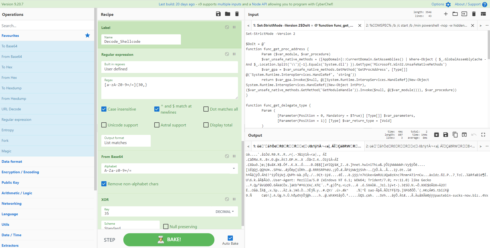  

## Recipe 29 - Log File Timestamp Manipulation with Subsections and Registers  

Not everyone thinks of CyberChef as a tool for log file analysis. But its handy if you have to transpose, reformat or maniulate a log file to suit your purpose. Here, we have an Apache log file with a timestamp that doesn't lead to useful temporal analysis with other log files: the date format is not sortable, its enclosed in square brackets and it's in UTC +1 not a standard UTC. Using Subsections, Registers and Transpose Date and Time we can change the formatting of the timestamp and move the column around to be able to combine it with other data. Awesome!  

Credit: [@gazambelli](https://twitter.com/gazambelli/status/1312767188365905920) and [@mattnotmax](https://twitter.com/mattnotmax/status/1312570631934799872)

### Recipe Details

`[{"op":"Fork","args":["\\n","\\n",false]},{"op":"Subsection","args":["\\[.*\\+0100\\]",true,true,false]},{"op":"Find / Replace","args":[{"option":"Regex","string":"\\[|\\]"},"",true,false,true,false]},{"op":"Translate DateTime Format","args":["Standard date and time","DD/MMM/YYYY:HH:mm:ss ZZ","Etc/GMT-1","YYYY-MM-DDTHH:mm:ss ZZ","UTC"]},{"op":"Merge","args":[]},{"op":"Fork","args":["\\n","\\n",false]},{"op":"Register","args":["(.*)(\\d{4}-.*\\+0000)(.*)",true,false,false]},{"op":"Find / Replace","args":[{"option":"Simple string","string":"$R0$R1$R2"},"$R1 $R0 $R2",true,false,true,false]}]`


## Recipe 30 - CharCode obfuscated PowerShell loader for a Cobalt Strike beacon

A variant on the standard PowerShell loader for Cobalt Strike. Here the first layer of obfuscation is a GZipped blob split into two CharCode arrays. The end result is up to you: disassembly, strings, extract IP, or parse UserAgent. Choose your own adventure. 

Source: [@scumbots](https://twitter.com/ScumBots/status/1314562082491322369) & https://pastebin.com/raw/mUFM4fcQ

### Recipe Details

`[{"op":"Regular expression","args":["User defined","\\d{1,3}",true,true,false,false,false,false,"List matches"]},{"op":"From Charcode","args":["Line feed",10]},{"op":"Gunzip","args":[]},{"op":"Regular expression","args":["User defined","[a-zA-Z0-9+/=]{30,}",true,true,false,false,false,false,"List matches"]},{"op":"From Base64","args":["A-Za-z0-9+/=",true]},{"op":"XOR","args":[{"option":"Decimal","string":"35"},"Standard",false]},{"op":"Strings","args":["Single byte",5,"All printable chars (A)",false]}]`

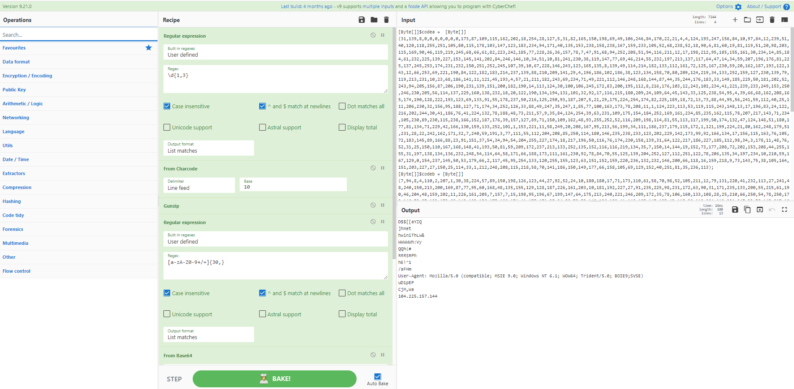

## Recipe 31 - Deobfuscate encoded strings in .NET binary

The SolarWinds malicious .dll contained obfuscated strings using compression and base64. Rather than lose the context in your analysis, we can do a quick de-obfuscation in-line by selecting the strings with a Subsection and then converting. The result is a function that becomes readable with context and avoids a potentially error-prone cut and paste.  

Credit: [@cybercdh](https://twitter.com/cybercdh) & [@Shadow0pz](https://twitter.com/Shadow0pz)  
Source: https://twitter.com/cybercdh/status/1338885244246765569 & https://twitter.com/Shadow0pz/status/1338911469480661000  

### Recipe Details

`[{"op":"Subsection","args":["(?<=\\(\\\")(.*)(?=\\\"\\))",true,true,false]},{"op":"From Base64","args":["A-Za-z0-9+/=",true]},{"op":"Raw Inflate","args":[0,0,"Adaptive",false,false]}]`  


## Recipe 32 - Extract malicious Gootkit DLL from obfuscated registry data

Gootkit stores a DLL inside the registry as encoded PowerShell. CyberChef makes mince meat of this so-called 'fileless' malware. A handy recipe provided by @StefanKelm puts the 'file' back in 'fileless' (yes, I thought of that one myself, we are up to recipe 32 my friends...). 

Source: https://github.com/StefanKelm/cyberchef-recipes

### Recipe Details

`[{"op":"Decode text","args":["UTF-16LE (1200)"]},{"op":"Regular expression","args":["User defined","[a-zA-Z0-9+/=]{30,}",true,true,false,false,false,false,"List matches"]},{"op":"From Base64","args":["A-Za-z0-9+/=",true]},{"op":"Decode text","args":["UTF-16LE (1200)"]},{"op":"Regular expression","args":["User defined","[a-zA-Z0-9+/=]{30,}",true,true,false,false,false,false,"List matches"]},{"op":"From Base64","args":["A-Za-z0-9+/=",true]},{"op":"Raw Inflate","args":[0,0,"Adaptive",false,false]}]`

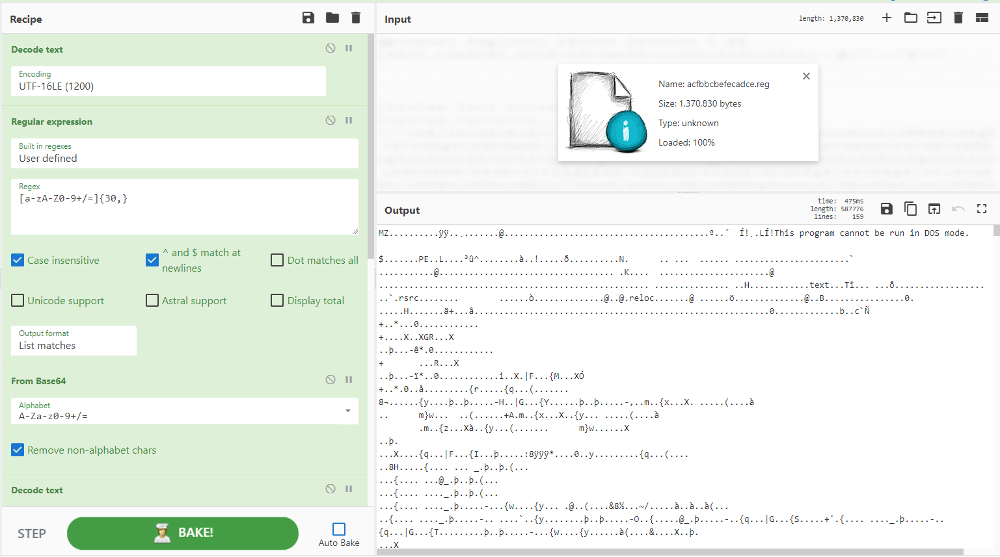

## Recipe 33 - Identify embedded URLs in Emotet PowerShell script

Using the powerful operation of Registers, a handy recipe from @Cryptolaemus1 extracts obfuscated URLs from the PowerShell from an Emotet malicious document. Here capture groups are used to grab the find/replace string which de-obfuscates the URLs. Awesome stuff.

Credit: [@Cryptolaemus](https://twitter.com/Cryptolaemus1) and [@NtRaiseException()](https://twitter.com/NtSetDefault)  
Source: https://twitter.com/Cryptolaemus1/status/1319357369902649344 

### Recipe Details

`[{"op":"Regular expression","args":["User defined","[a-zA-Z0-9+/=]{30,}",true,true,false,false,false,false,"List matches"]},{"op":"From Base64","args":["A-Za-z0-9+/=",true]},{"op":"Decode text","args":["UTF-16LE (1200)"]},{"op":"Find / Replace","args":[{"option":"Regex","string":"'\\)?\\+\\(?'"},"",true,false,true,false]},{"op":"Register","args":["\\(+'(=[\\w\\d]*)'\\)+,'/'\\)",true,false,false]},{"op":"Find / Replace","args":[{"option":"Simple string","string":"$R0"},"/",true,false,true,false]},{"op":"Register","args":["\\/(.)http",true,false,false]},{"op":"Find / Replace","args":[{"option":"Simple string","string":"$R1"},"\\n",true,false,true,false]},{"op":"Find / Replace","args":[{"option":"Regex","string":"'"},"\\n",true,false,true,false]},{"op":"Extract URLs","args":[false]}]`

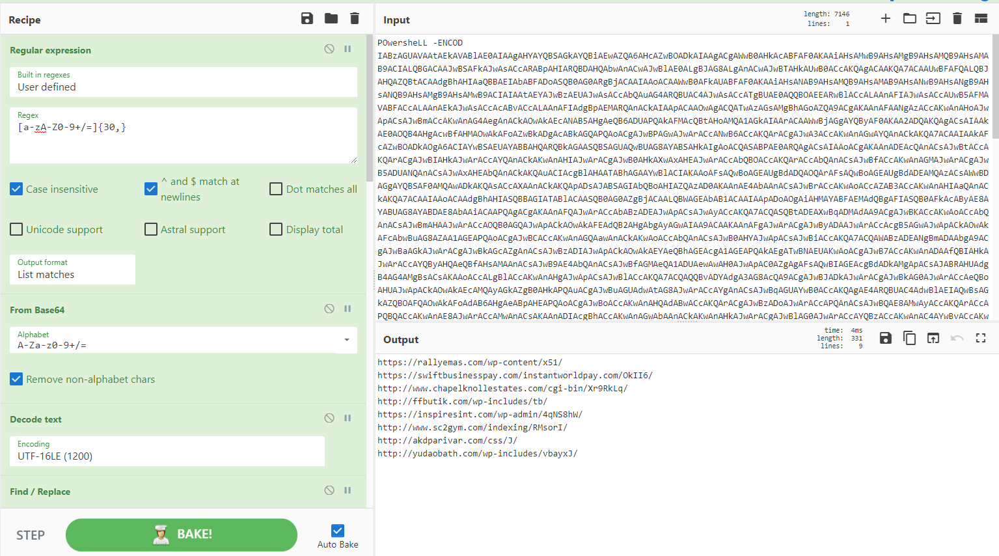

## Recipe 34 - Analysing OOXML Files for URLs

Didier Stevens demonstrates the amazing simplicity and usefulness of CyberChef by extracting URLs from OOXML documents (e.g. .docx files). By unzipping the file and filtering out the 'known good' the remaining URLs can be inspected. Don't forget to defang to avoid any unnecessary clicks or operational security mistakes. Combine with CyberChef 'tabs' functionality and you could analyse a batch of files.

Credit: [@DidierStevens](https://twitter.com/DidierStevens)  
Source: https://isc.sans.edu/diary/27020

### Recipe Details

`[{"op":"Unzip","args":["",false]},{"op":"Extract URLs","args":[false]},{"op":"Filter","args":["Line feed","http://schemas\\.openxmlformats\\.org/",true]},{"op":"Filter","args":["Line feed","http://schemas\\.microsoft\\.com/",true]},{"op":"Filter","args":["Line feed","http://purl\\.org/",true]},{"op":"Filter","args":["Line feed","http://www\\.w3\\.org/",true]},{"op":"Defang URL","args":[true,true,true,"Valid domains and full URLs"]}]`

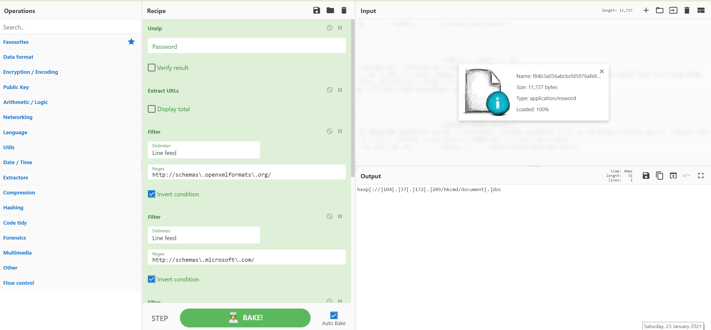

## Recipe 35 - Decrypting REvil PowerShell ransomware sample

An AES encrypted PowerShell ransomware script is no match for CyberChef. Here were can convert the Base64 to hex, extract the IV and Key into registers and use them to decrypt the blob. Once decrypted we can examine the data and identify a PE file 1925 bytes into the decrypted blob. Extracting this we can then use other tools to identify its behaviour including detonation or static analysis.  

Source: [@mattnotmax](https://twitter.com/mattnotmax/status/1357277957056679936)  
Further Info: [Powershell Dropping a REvil Ransomware](https://isc.sans.edu/forums/diary/Powershell+Dropping+a+REvil+Ransomware/27012/)  

`[{"op":"Subsection","args":["(?<=\\\")([a-zA-Z0-9+/=]{20,})(?=\\\")",true,true,false]},{"op":"From Base64","args":["A-Za-z0-9+/=",true]},{"op":"To Hex","args":["None",0]},{"op":"Merge","args":[]},{"op":"Register","args":["(?<=\\\")([a-fA-F0-9]{32})(?=\\\")",true,false,false]},{"op":"Register","args":["(?<=\\\")([a-fA-F0-9]{64})(?=\\\")",true,false,false]},{"op":"Regular expression","args":["User defined","[a-f0-9]{100,}",true,true,false,false,false,false,"List matches"]},{"op":"AES Decrypt","args":[{"option":"Hex","string":"$R1"},{"option":"Hex","string":"$R0"},"CBC","Hex","Raw",{"option":"Hex","string":""},""]},{"op":"Regular expression","args":["User defined","[a-f0-9]{30,}",true,true,false,false,false,false,"List matches"]},{"op":"From Hex","args":["Auto"]},{"op":"Drop bytes","args":[0,1925,false]},{"op":"SHA2","args":["256",64,160]}]`  

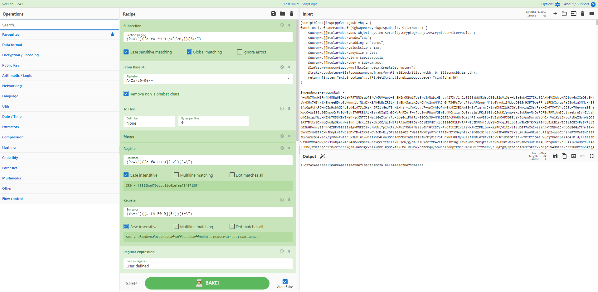

## Recipe 36 - Create a CyberChef Password Generator  

Ok, so I'm kinda cheating here, as the bulk of the work is being done by an API. But it's a good example to remind you the HTTP Requests operation can be a super powerful way of augmenting CyberChef. Here I made a little 'input form' in the CyberChef input pane, and use regular expressions to capture the key paramters for the API call into Registers. A little text massage, and you can have a quick and easy generator as you need it. Saved as a recipe for when you need to deliver a quick new password to a new user.  

Source: [@mattnotmax](https://twitter.com/mattnotmax)  

`[{"op":"Register","args":["(?<=number:\\s)(.*)",true,false,false]},{"op":"Register","args":["(?<=words:\\s)(.*)",true,false,false]},{"op":"Register","args":["(?<=length:\\s)(.*)",true,false,false]},{"op":"HTTP request","args":["GET","https://makemeapassword.ligos.net/api/v1/passphrase/plain?pc=$R0&wc=$R1&sp=y&maxCh=$R2","","Cross-Origin Resource Sharing",false]},{"op":"Find / Replace","args":[{"option":"Regex","string":" "},"-",true,false,true,false]}]`  

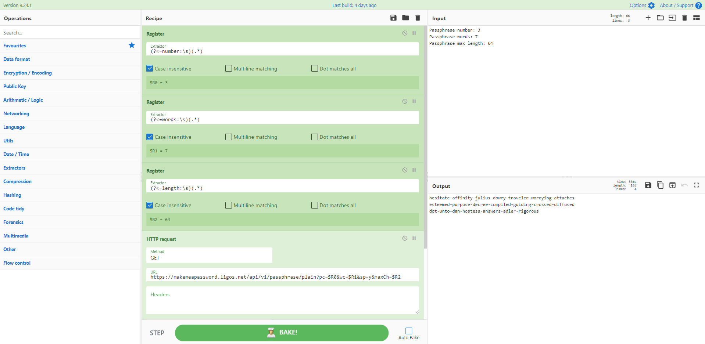  

## Recipe 37 - From Sandbox zipped email to malicious URL  

Most sandboxes deliver a zipped file with the generic password 'infected'. Why risk extracting out to your desktop when you can extract the contents in CyberChef? Here we have an email `.eml` file which includes an OLE2 file attachment. `Strings` identifies Base64 which is then extracted and decoded to pull out the second stage.  

Source: [Any.run](https://app.any.run/tasks/181c1d93-c838-49a4-8e62-76ee696d1b72/)  

`[{"op":"Unzip","args":["infected",false]},{"op":"Find / Replace","args":[{"option":"Regex","string":"\\n"},"",true,false,true,false]},{"op":"Regular expression","args":["User defined","[a-zA-Z0-9+/=]{400,}",true,true,false,false,false,false,"List matches"]},{"op":"From Base64","args":["A-Za-z0-9+/=",true]},{"op":"Strings","args":["16-bit littleendian",400,"Null-terminated strings (U)",false]},{"op":"Decode text","args":["UTF-16LE (1200)"]},{"op":"Regular expression","args":["User defined","[a-zA-Z0-9+/=]{2000,}",true,true,false,false,false,false,"List matches"]},{"op":"From Base64","args":["A-Za-z0-9+/=",true]},{"op":"Decode text","args":["UTF-16LE (1200)"]},{"op":"Extract URLs","args":[false]},{"op":"Defang URL","args":[true,true,true,"Valid domains and full URLs"]}]`  

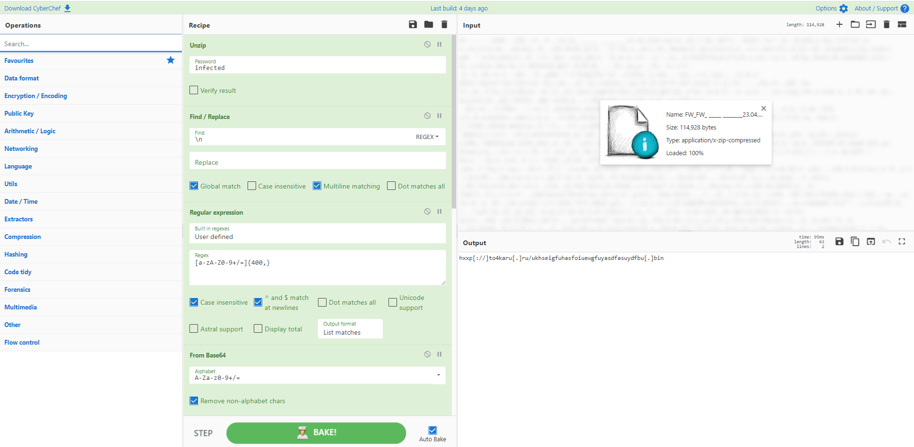  


## Recipe 38 - Planes, Skulls and Envelopes - Live and Let PowerShell    

A substitution is a substitution. It can be letter for letter, letter for number, or letter for...skull? Here the obfuscation may initially look more confusing but its actually no different to other types. Find/Replce, Subsection, From Base64...all a standard day out for CyberChef. I've reversed the first section to enable extraction of the url, then continue with the deobfuscation.  

Source: [any.run](https://app.any.run/tasks/0874b873-2dde-4540-85f5-7ede1a1bfaf6/#)  
Credit: https://twitter.com/neonprimetime/status/1365351048525791232  

`[{"op":"Find / Replace","args":[{"option":"Regex","string":"☠"},"B",true,false,true,false]},{"op":"Subsection","args":["[a-zA-Z0-9+/=]{300,}",true,true,false]},{"op":"From Base64","args":["A-Za-z0-9+/=",true]},{"op":"Decode text","args":["UTF-16LE (1200)"]},{"op":"Reverse","args":["Character"]},{"op":"Merge","args":[]},{"op":"Find / Replace","args":[{"option":"Simple string","string":"_✉✈_"},"A",true,false,true,false]},{"op":"Regular expression","args":["User defined","[a-zA-Z0-9+/=]{300,}",true,true,false,false,false,false,"List matches"]},{"op":"From Base64","args":["A-Za-z0-9+/=",true]}]`  

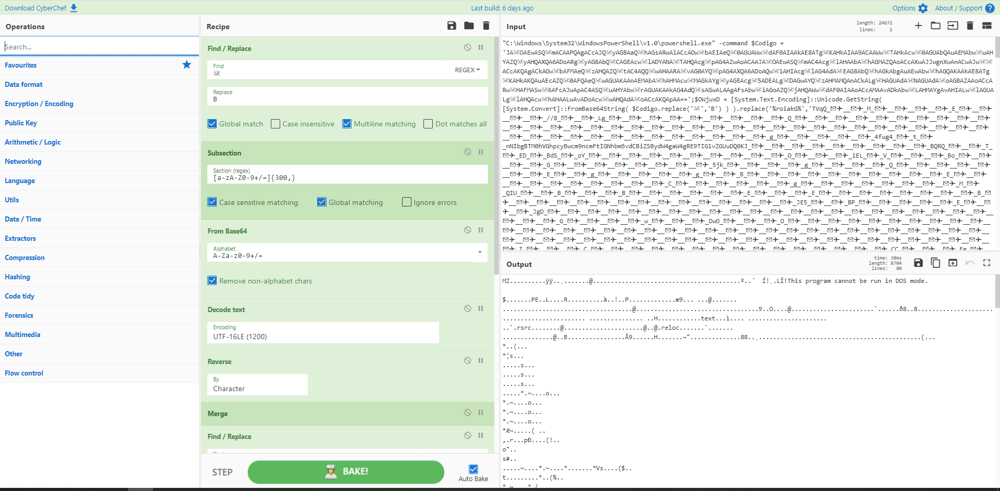  

## Recipe 39 - Decrypt GoldMax aka Sunshutte encrypted configuration files

GoldMax aka Sunshuttle drops an encrypted configuration file when it executes. In the RE analysis by Microsoft and Fireeye the algorithm and keys were identified and published, making it a breeze to decrypt with CyberChef.   

Source 1: https://www.microsoft.com/security/blog/2021/03/04/goldmax-goldfinder-sibot-analyzing-nobelium-malware/  
Source 2: https://www.fireeye.com/blog/threat-research/2021/03/sunshuttle-second-stage-backdoor-targeting-us-based-entity.html 

`[{"op":"From Base64","args":["A-Za-z0-9-_",true]},{"op":"AES Decrypt","args":[{"option":"UTF8","string":"hz8l2fnpvp71ujfy8rht6b0smouvp9k8"},{"option":"Hex","string":"00000000000000000000000000000000"},"CFB","Raw","Raw",{"option":"Hex","string":""}]},{"op":"Subsection","args":["[a-zA-Z0-9+/=]{50,}",true,true,false]},{"op":"From Base64","args":["A-Za-z0-9+/=",true]},{"op":"Merge","args":[]},{"op":"Drop bytes","args":[0,16,false]},{"op":"Take bytes","args":[0,120,false]},{"op":"Register","args":["(^.*?)\\|(.*?)\\|(.*?)\\|(.*)\\|(.*)",true,false,false]},{"op":"Find / Replace","args":[{"option":"Regex","string":".*"},"MD5 of Execution Time:\\t\\t\\t$R0\\nLower/Upper Limit for Sleep Time:\\t$R1\\nUtilize “blend-in” traffic requests:\\t$R2\\nEnd execution timestamp:\\t\\t$R2\\nUser-agent for HTTPS requests:\\t\\t$R4",false,false,false,false]}]` 

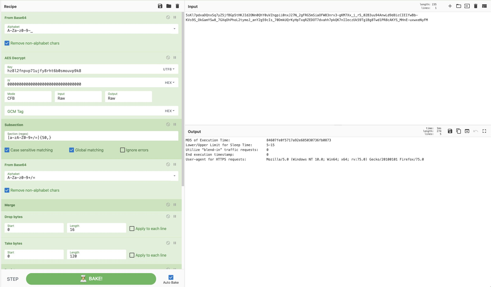  

## Recipe 40 - Morse Code Madness   

Yes, there is a morse code operation in CyberChef. Yes, you may need to use it one day. Sadly this wasn't malware but still CyberChef does the job. Thanks to [@pmelson](https://twitter.com/pmelson) and [@cyber__sloth](https://twitter.com/cyber__sloth) for this entry.  

Source: https://pastebin.com/raw/PvLuparz  
Recipe: https://twitter.com/cyber__sloth/status/1367904890157211654  

`[{"op":"From Binary","args":["Space",8]},{"op":"From Morse Code","args":["Space","Forward slash"]},{"op":"Reverse","args":["Character"]},{"op":"ROT13","args":[true,true,false,13]}]`  

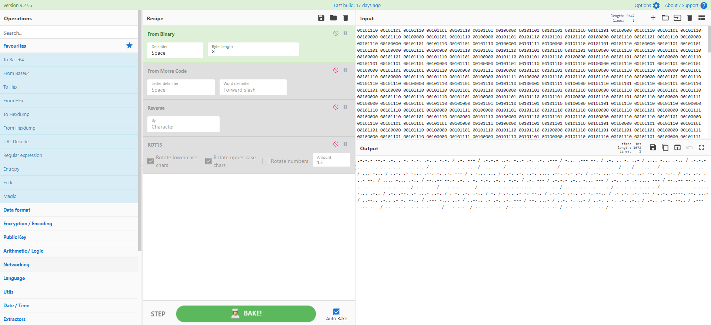  

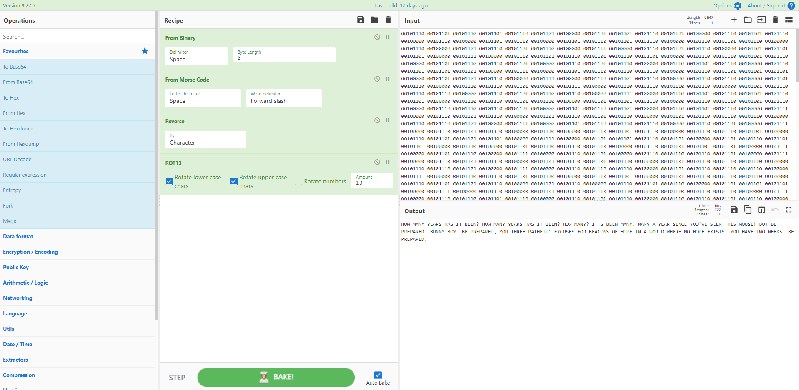  

## Recipe 41 - PHP mixed hexadecimal and octal encoding

What do we want? Mixed encoding with both hexadecimal and octal in the one set! When do we want it? Now!  

Source: https://twitter.com/JCyberSec_/status/1368963598475739137  

`[{"op":"Fork","args":["\\n","\\n",false]},{"op":"Subsection","args":["\\\\x[a-fA-F0-9]{2}",true,true,false]},{"op":"From Hex","args":["\\x"]},{"op":"Merge","args":[]},{"op":"Subsection","args":["\\\\\\d{3}",true,true,false]},{"op":"Find / Replace","args":[{"option":"Regex","string":"\\\\"},"",true,false,true,false]},{"op":"From Octal","args":["Space"]}]`  

  

# Training

I've developed a course 'CyberChef for Security Analysts' which contains 10 hours of instuctional videos plus labs through Applied Network Defense. To find out more visit [learncyberchef.com](http://learncyberchef.com)

# Resources, Books & Blog Articles

[Twitter #cyberchef](https://twitter.com/search?q=%23cyberchef)  
[CyberChef & DFIR](https://bitofhex.com/2018/05/29/cyberchef/)  
[CyberChef Docker Image](https://hub.docker.com/r/remnux/cyberchef/) (untested!)   
[Static Malware Analysis with OLE Tools and CyberChef](https://newtonpaul.com/static-malware-analysis-with-ole-tools-and-cyber-chef/#)  
[Analyzing obfuscated Powershell with shellcode](https://medium.com/@tstillz17/analyzing-obfuscated-powershell-with-shellcode-1b6cb8ab5ab0)  
[Solving Simple Crypto Challenges with CyberChef](http://www.codehead.co.uk/tamuctf-2019-crypto-cyberchef/)  
[CyberChef: BASE64/XOR Recipe](https://isc.sans.edu/forums/diary/CyberChef+BASE64XOR+Recipe/24212/)  
[Deciphering Browser Hieroglyphics: LocalStorage (Part 2)](https://dfir.blog/deciphering-browser-hieroglyphics-localstorage/)  
[Cooking with the Cyber-Chef 2020](https://www.amazon.com.au/Cooking-Cyber-Chef-2020-Cyberchef-Awesome-ebook/dp/B085LMP1NR/)  

# Instructional Videos

[13cubed: Cooking with CyberChef](https://www.youtube.com/watch?v=eqbTQpGSR7g)  
[Decoding Metasploit framework and CobaltStrike shells](https://www.youtube.com/watch?v=Y50WdhSDjic)  
[Hiding Malicious code using windows CMD - Dosfuscation](https://www.youtube.com/watch?v=ptsF2PvD4vY)  
[Splunk TA (Technology Add-on) Example](https://vimeo.com/243919059)  

# Browser & Application Extensions/APIs

I haven't tested these, so caveat emptor.  

[FireFox](https://addons.mozilla.org/en-US/firefox/addon/open-in-cyberchef/)  
[Chrome](https://chrome.google.com/webstore/detail/open-in-cyberchef/aandeoaihmciockajcgadkgknejppjdl)  
[Burp - SentToCyberChef](https://github.com/xorrbit/Burp-SendToCyberChef)  
[CyberSaucier](https://github.com/DBHeise/CyberSaucier)  
[Official CyberChef Server](https://github.com/gchq/CyberChef-server)  
[Splunk TA (Technology Add-on)](https://github.com/daveherrald/TA-cyberchef)  


# Presentations / Conference Talks

[@GlassSec: Zero to Hero with CyberChef](https://www.osdfcon.org/presentations/2019/Jonathan-Glass_Cybersecurity-Zero-to-Hero-With-CyberChef.pdf)


## Contributions

Happy to add (and learn) more. Pull request or tweet to @mattnotmax!  

Please include original source of text and recipe developer (if not yourself). For consistency in pasting into CyberChef I have found the best results are to export the function as compact JSON.


